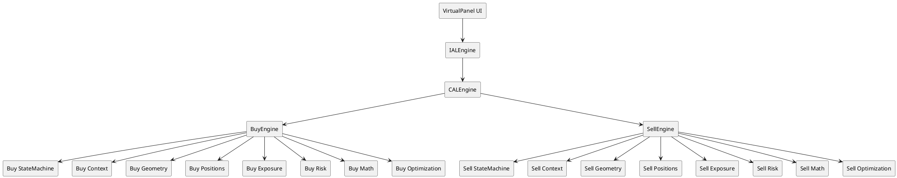

# ALE_ARCHITECTURE_LOCK.md
## Архитектурный замок (Architecture Lock) системы ALE

Версия: 1.0  
Статус: Нормативный архитектурный документ  
Область действия: `Experts/VirtualPanel/right/ale/`

---

## 1. Purpose of Architecture Lock

Цель этого документа — зафиксировать неизменяемые архитектурные правила ALE, которые являются частью математической корректности системы.

Ключевая идея:

> Архитектура ALE не является «технической реализацией по вкусу», а является частью формальной модели риска, устойчивости и инвариантов.

Если нарушается изоляция потоков BUY/SELL, то:
- перестают гарантироваться инварианты I1–I8;
- ломается аддитивность глобальных метрик;
- SAFE-поведение становится некорректным.

---

## 2. High-Level Architecture

Нормативная верхнеуровневая схема:



ASCII-дубликат:

```text
VirtualPanel(UI)
      |
      v
  IALEngine
      |
      v
  CALEngine
   /     \
  v       v
BuyEngine SellEngine
```

---

## 3. Dual Stream Principle

Формальный принцип:

\[
BUY\_STREAM \neq SELL\_STREAM
\]

Каждый поток — полностью независимый вычислительный граф (fully isolated computational graph), включающий:
- свой `StateMachine`,
- свой `Context`,
- свою `Geometry`,
- свой `PositionBook`,
- свой `ExposureFlow`,
- свой `RiskEngine`,
- свой цикл оптимизации.

Допускается только агрегирование результатов на уровне оркестратора.

---

## 4. Component Isolation Matrix

| Component      | BUY | SELL | Shared |
|----------------|-----|------|--------|
| PositionBook   | ✔   | ✔    | ✖      |
| Geometry       | ✔   | ✔    | ✖      |
| Exposure       | ✔   | ✔    | ✖      |
| Risk           | ✔   | ✔    | ✖      |
| Context        | ✔   | ✔    | ✖      |
| Math Layer     | ✔   | ✔    | ✔      |
| Config         | ✔   | ✔    | ✔      |

Правило shared:
- только immutable/stateless/pure.

---

## 5. Allowed Shared Components

Разрешённые shared-компоненты:
- `CALGBMModel`
- `CALReturnProbability`
- `CALClosedForm`
- `CALPhaseDiagram`
- `CALRiskConfig`

Ограничения:
1. отсутствует mutable-состояние, изменяемое между потоками;
2. методы являются чистыми функциями (pure);
3. отсутствуют side effects.

---

## 6. Forbidden Architecture Patterns

Запрещённые паттерны:

### 6.1 Shared PositionBook
```text
BuyEngine -> PositionBook <- SellEngine
```
Недопустимо.

### 6.2 Shared RiskEngine
```text
BuyEngine -> RiskEngine <- SellEngine
```
Недопустимо.

### 6.3 Shared ExposureFlow
```text
BuyEngine -> ExposureFlow <- SellEngine
```
Недопустимо.

### 6.4 Cross-stream mutable assignment
```cpp
buyEngine.PositionBook = sellEngine.PositionBook; // ЗАПРЕЩЕНО
```

### 6.5 Cross-stream direct method calls
```cpp
buyEngine.UpdateUsing(sellEngine.Context()); // ЗАПРЕЩЕНО
```

---

## 7. Data Flow Contract

Нормативный pipeline одного тика (на поток):

```text
PriceUpdate
  ↓
Geometry.BuildGrid
  ↓
Positions.UpdatePnL
  ↓
Exposure.Calculate
  ↓
Risk.Check
  ↓
Math.Analytics
  ↓
Optimization
```

BUY и SELL выполняют pipeline независимо.

Псевдокод:

```text
for each tick price:
  buy_state  = BUY_PIPELINE(price, buy_state)
  sell_state = SELL_PIPELINE(price, sell_state)
  total      = AGGREGATE(buy_state, sell_state)
```

---

## 8. Engine Orchestration

`CALEngine` — только оркестратор:
- создаёт `BuyEngine` и `SellEngine`,
- инициирует обновления потоков,
- агрегирует read-only метрики,
- применяет глобальные policy-проверки (без вмешательства в внутренние графы потоков).

`CALEngine` не должен:
- связывать внутренние mutable-объекты потоков,
- выполнять cross-calls между потоками,
- изменять внутренние структуры потока напрямую.

---

## 9. Context Isolation

Каждый поток имеет свой контекст:
- `PnL`
- `NetDelta`
- `Exposure`
- `Margin`
- `Drawdown`
- `SAFE flag`

Контексты BUY/SELL не могут иметь общих mutable-полей/ссылок.

---

## 10. SAFE Mode Contract

SAFE определяется локально на поток:
- BUY может быть в SAFE,
- SELL может быть в BASE/EXPANSION,
- и наоборот.

Это допустимо и нормативно корректно.

Глобальный SAFE на уровне оркестратора может быть вычислен как policy, но не должен нарушать потоковую изоляцию.

---

## 11. Aggregation Layer

Агрегация выполняется только на уровне `CALEngine`:

\[
TotalPnL = PnL_{buy} + PnL_{sell}
\]
\[
TotalDelta = \Delta_{buy} + \Delta_{sell}
\]
\[
TotalExposure = E_{buy} + E_{sell}
\]

Агрегация read-only и не меняет внутренние состояния потоков.

---

## 12. Mathematical Consistency

Архитектура изоляции нужна для строгого выполнения:

\[
PnL_{total}=PnL_{buy}+PnL_{sell}
\]

\[
\Delta_{total}=\Delta_{buy}+\Delta_{sell}
\]

При shared mutable state эти равенства перестают быть гарантированными.

---

## 13. Thread Safety Preparation

Текущая реализация может быть однопоточной, но архитектура обязана поддерживать безопасную эволюцию к параллельному выполнению:
- BUY в потоке A,
- SELL в потоке B.

Условие готовности: отсутствие shared mutable межпоточных объектов.

---

## 14. CI Architecture Checks

CI обязан проверять:
1. отсутствие shared `PositionBook`;
2. отсутствие shared `RiskEngine`;
3. отсутствие shared `ExposureFlow`;
4. отсутствие cross-stream direct calls;
5. сохранение аддитивности агрегатов.

Минимальные статические проверки (пример):

```text
- no assignment Buy.* = Sell.* for mutable components
- no function signatures accepting opposite-stream mutable references
```

---

## 15. Architecture Tests

Связь с тестами:
- `TestALEContracts` — SAFE non-bypass + additivity + phase guard;
- `TestALERegression` — deterministic replay/reset;
- `TestRisk` — risk monotonicity и SAFE consistency.

При падении этих тестов архитектурный lock считается нарушенным.

---

## 16. Future Extension Rules

При добавлении новых потоков (`HEDGE`, `OPTION`, и т.д.):
- каждый поток должен быть отдельным движком;
- каждый поток должен иметь изолированные `Context/Positions/Risk/Exposure/Geometry/FSM`;
- общими могут быть только immutable math/config компоненты.

---

## 17. Breaking Changes Policy

Архитектурным breaking change считается:
1. shared mutable state между потоками;
2. cross-stream dependency в core/risk/exposure/positions;
3. shared risk model instance на два потока;
4. обход SAFE-контракта через публичные API.

Любое такое изменение требует отдельного архитектурного RFC.

---

## 18. Architecture Lock Statement

> The dual-stream architecture of ALE is locked.  
> Any modification violating stream independence is considered a breaking architectural change.

Русская формулировка:

> Двухпоточная архитектура ALE является зафиксированной (locked).  
> Любая модификация, нарушающая независимость потоков, считается критическим архитектурным нарушением.

---

## 19. Связь с formal-spec пакетом

Документ является частью пакета:
- `ALE_FORMAL_SPEC.md`
- `ALE_INVARIANTS.md`
- `ALE_RISK_PROOF.md`
- `ALE_MONTE_CARLO_SPEC.md`
- `ALE_ARCHITECTURE_LOCK.md`

Если меняется любой фундаментальный архитектурный контракт — этот документ обновляется синхронно.

